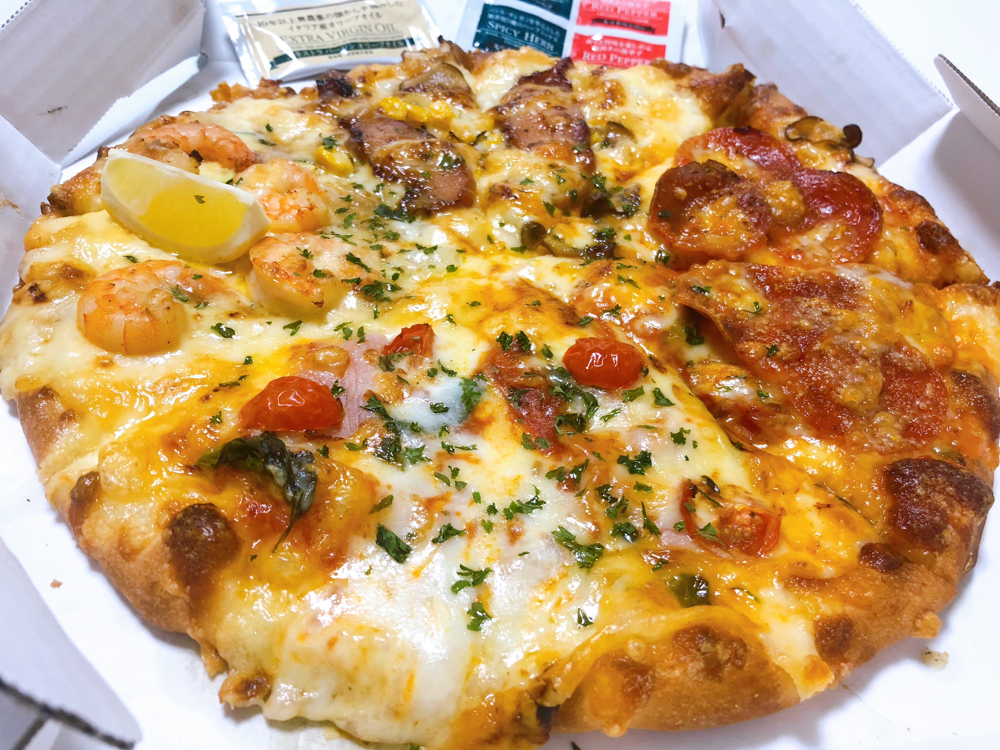

緊急事態宣言で外出自粛の中、毎日自炊をするのは大変ってことで我が家もデリバリーを活用してみました！

「デリバリー」と聞いてまず思いついたのがピザ！ 

TVCMやクーポンで見かける有名どころのピザ屋さんのなかで田舎にある我が家まで宅配してくれるお店は唯一「PIZZA-LA」さんのみ。 

 

早速ネット注文！ 

今回は「絶品グルメクォーター」Mサイズ（税込2462円）を頼んでみました！

注文して約40分！予測宅配時間内にちゃんと届きました！

<figure><figcaption>絶品グルメクォーター　Mサイズ（税込2280円）</figcaption></figure>

<絶品グルメクォーター>　\*時計回り順 

・テリヤキチキン 

・マスカルポーネと熟成サラミ 

・ブラータチーズの贅沢マルゲリータ 

・大海老のガーリックシュリンプ 

（オリーブオイルとレモンが付属）

1枚のピザで4種類の味が楽しめて、食べ応えも十分！！ 

何よりも温かいうちに届けてくれ、安心して自宅で食べられるというのはありがたいです！

PIZZA-LAさんの公式ホームページから会員登録すると初回特典で400円の割引でお得に頼めました♪

コロナが流行っている今、デリバリーやテイクアウトの需要が増えてくると思うので上手に活用していきたいものですね！

