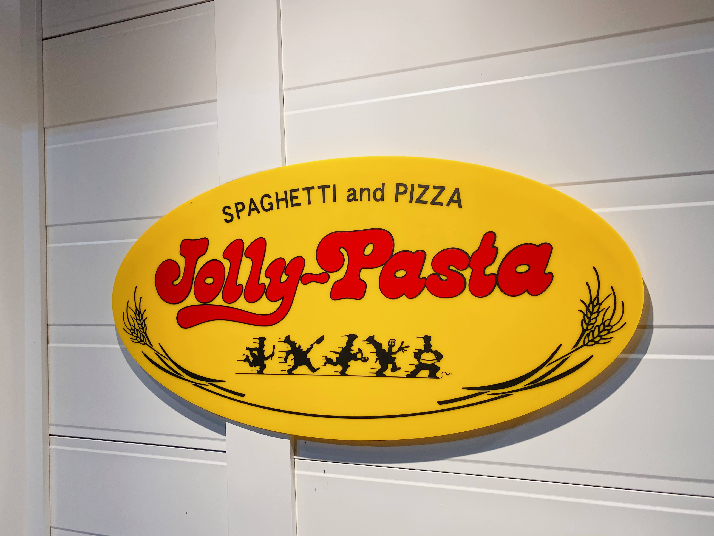
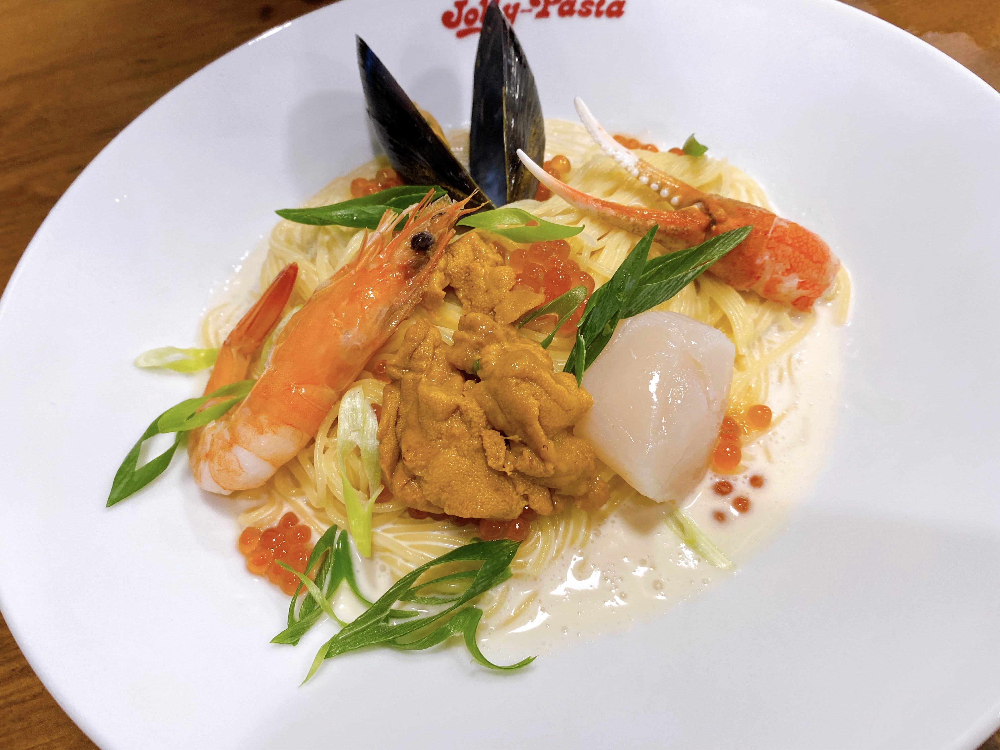
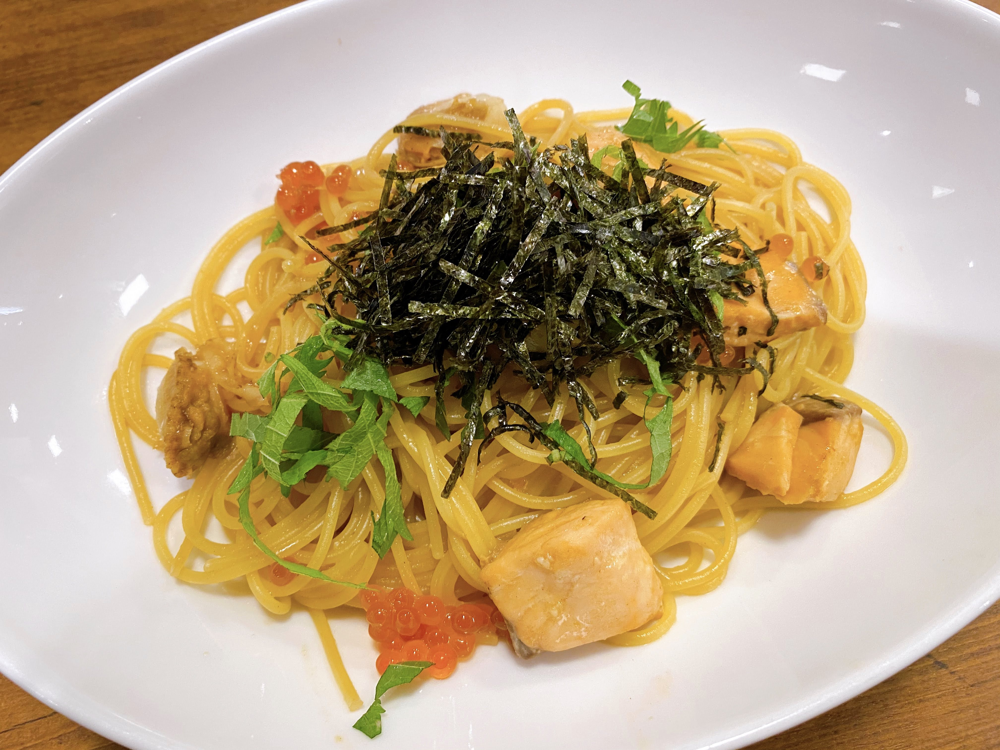
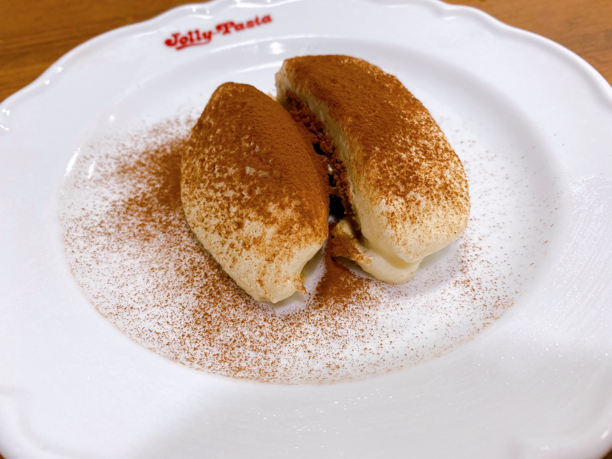

「ここおいしいらしいよ！」 

そんな口コミを聞いて早速行ってみた！

愛知県で唯一店舗があるのは名古屋市内ではなく、名古屋駅から車で約20分離れた大治町。

<figure><figcaption>看板</figcaption></figure>

パスタ専門店というだけあって、ソースの種類は豊富に感じました。

まずは、期間限定メニューから。 

「贅沢うにと海の幸の冷製カッペリーニ 〜レフォール添え〜」  

とにかく具材が豪華。素麺のような細麺に濃厚なクリームがよく絡み、冷たくて喉越しがよく美味しかったです。

<figure><figcaption>贅沢うにと海の幸の冷製カッペリーニ 〜レフォール添え〜</figcaption></figure>

グランドメニューから 

「サーモンとホタテの和風ソース」 

 

サーモン、ホタテ、いくらが入っています。濃い味が好きな方におすすめです。

<figure><figcaption>サーモンとホタテの和風ソース</figcaption></figure>

ピザも注文！ 

「ピッツァ・プレミアムマルゲリータ」

花畑牧場のチーズ使用！ 

個人的に生地にトマトソースをつけてチーズを散らしただけというさっぱりとした印象のお味でした。

<figure><figcaption>ピッツァ・プレミアムマルゲリータ</figcaption></figure>

最後はデザート！ 「特製ティラミス」

チーズの濃厚さより、洋酒が強めな感じでした。

<figure><figcaption>特製ティラミス</figcaption></figure>

ただいま期間限定で夏のエビ、うにフェアが開催中！ 

どちらも好きなので他の期間限定メニューにも興味あり！ 

 

パスタの種類も豊富なのでまた違う味も食べてみたいなと思いました。

