愛知県あま市にある「萱津神社」

<figure>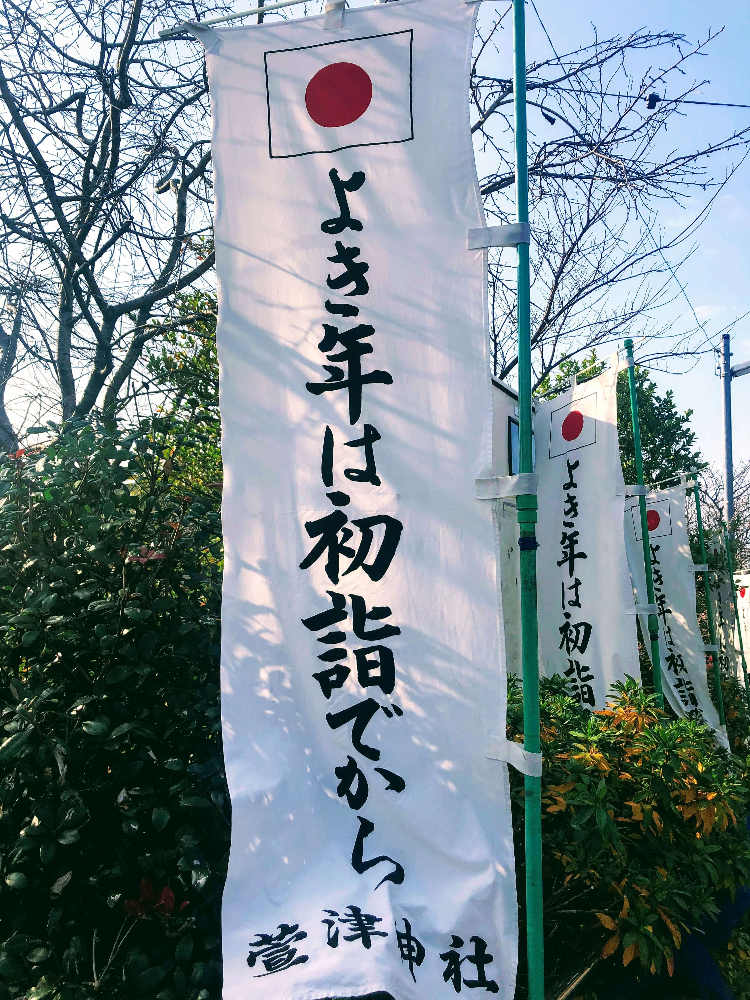<figcaption>萱津神社</figcaption></figure>

全国唯一の漬物の神社だそうですが、お目当はこちらの「銭神社」

<figure>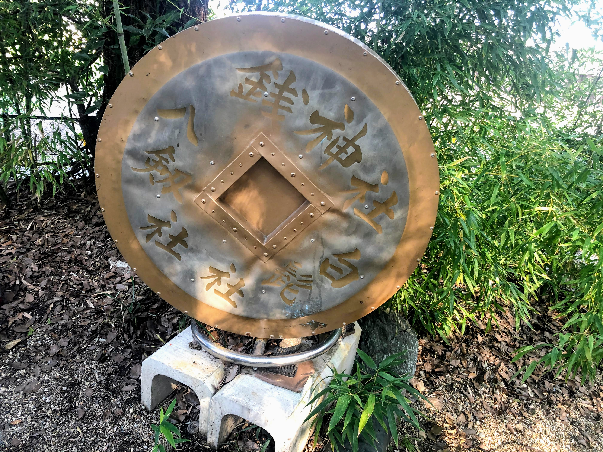<figcaption>銭神社</figcaption></figure>

これ回転するんです。金回りがよくなりますように

と願いをこめて回してきました。また、この萱津神社は縁結び

としても知られているようですよ。

続いて向かったのは名鉄甚目寺駅近くにある「甚目寺観音」

。甚目寺では有名な観光スポットです。

<figure>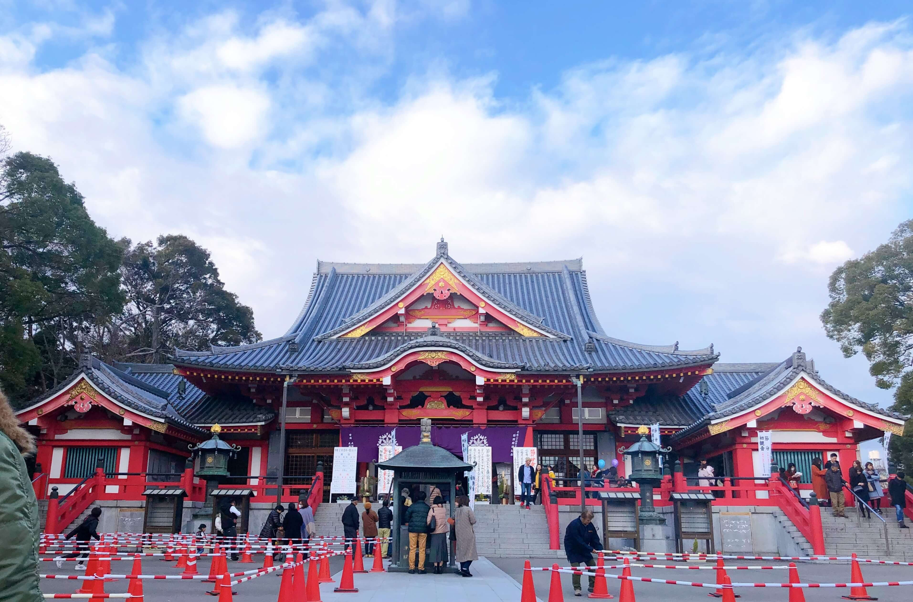<figcaption>甚目寺観音本堂</figcaption></figure>

人混みのピークを避けられたのでしょうか、コーンが並べられていました。こちらでは本堂の他にもいくつかお堂があり、それぞれの場所にスタンプが置いてあったのでお堂巡りも楽しいかもしれません。また、法隆寺につぐ古い建築物らしく重要文化財もいくつかありました。

<figure><figcaption>順拝図</figcaption></figure>

本堂向かって左手の道を抜けると「漆部（ぬりべ）神社」

があります。

<figure>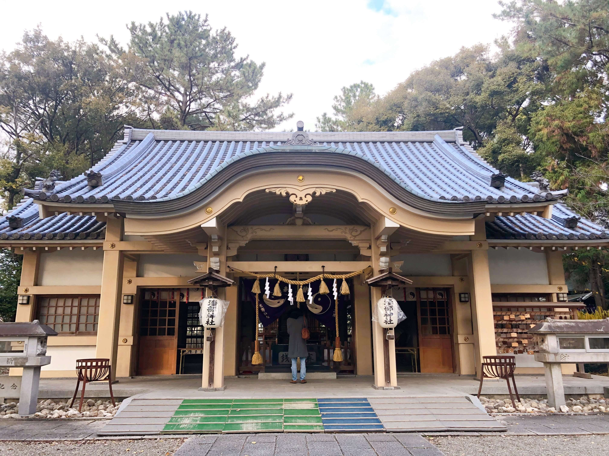<figcaption>漆部神社</figcaption></figure>

<figure>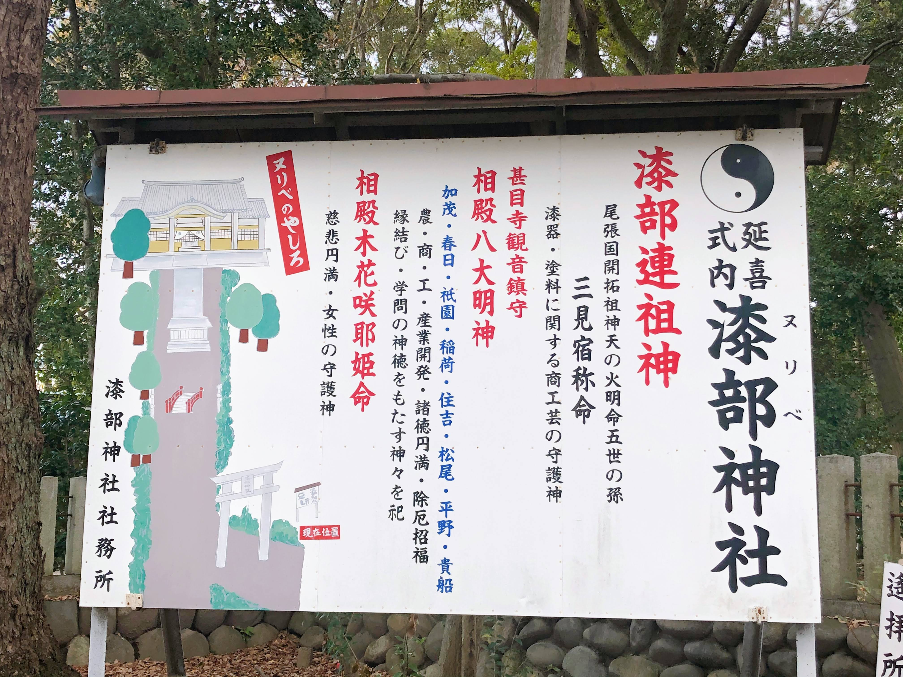<figcaption></figcaption></figure>

こちらのご利益は農・商・工・産業開発、諸徳円満、除厄招福、縁結び、学問の神徳みたいです。

赤い太鼓橋も印象的です。

<figure>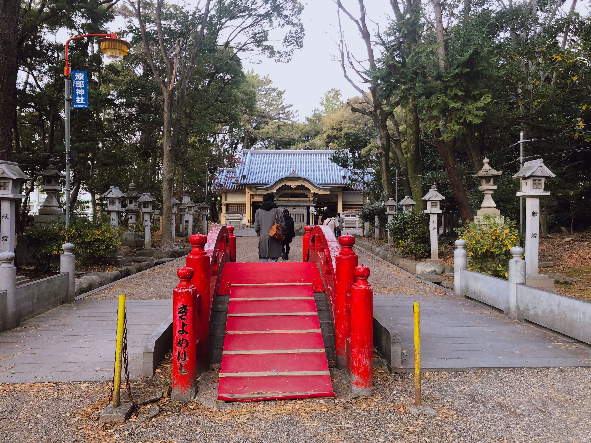<figcaption>きよめはし</figcaption></figure>

<figure>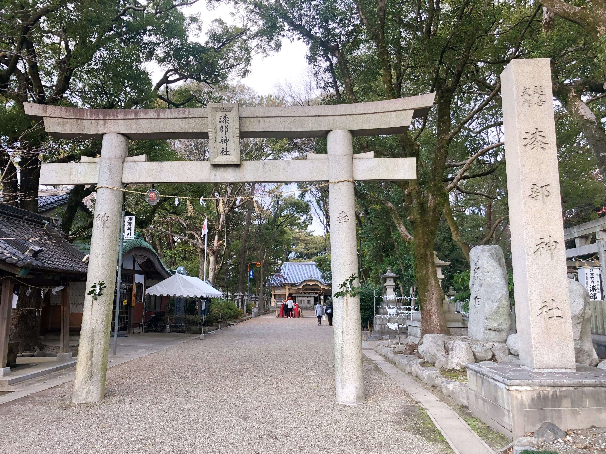<figcaption></figcaption></figure>

大きな鳥居を出て左に歩いて行くと「大徳院」

があり「えびす大黒」

が名物みたいです。

<figure>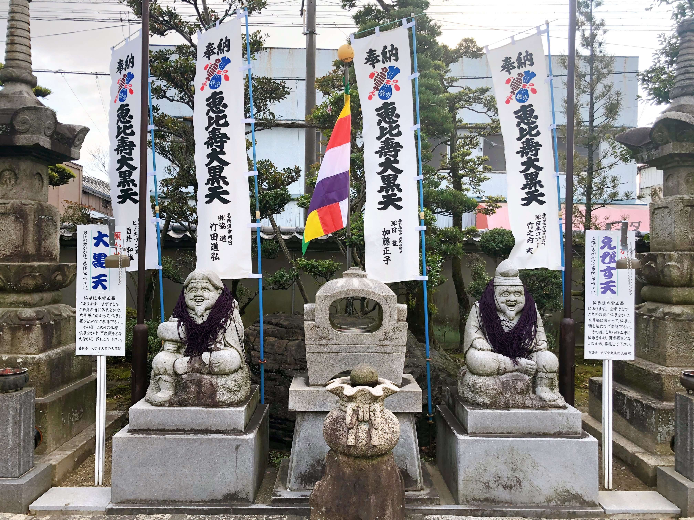<figcaption>写真左：大黒様　写真右：えびす様</figcaption></figure>

仏糸を男性は大黒様

に、女性はえびす様

にかけ、願いをかけるようです。

大徳院を出て右に歩くと角にレトロなカフェを発見！！ちょっとこちらで一休み。

「MONZEN COFFEE」

<figure>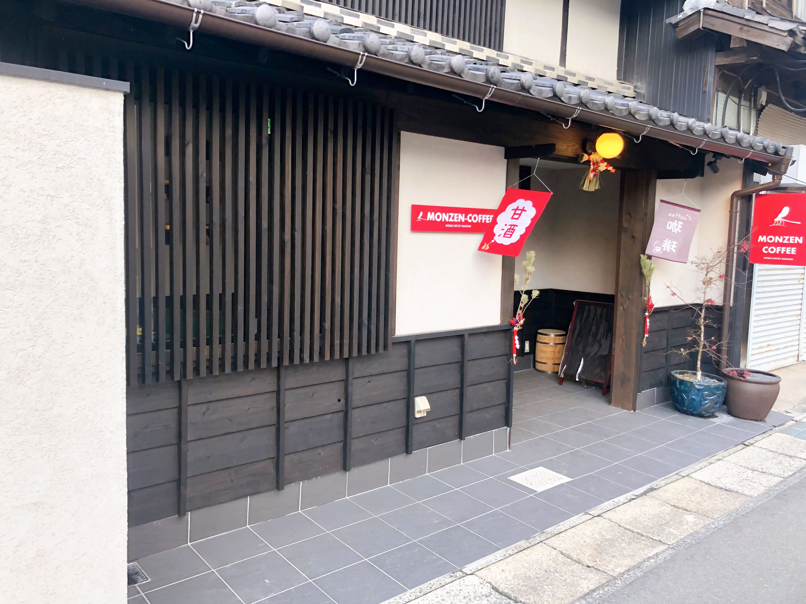<figcaption>MONZEN COFFEE</figcaption></figure>

外見と店名の看板にギャップを感じますが、店内は落ち着いた雰囲気でカウンター越しにマスターがコーヒーを淹れている姿が見えるなんとも素敵な空間。

メニューも豊富で豆へのこだわりを感じるラインナップ。日替わりコーヒーや女性に優しいメニューも。

<figure>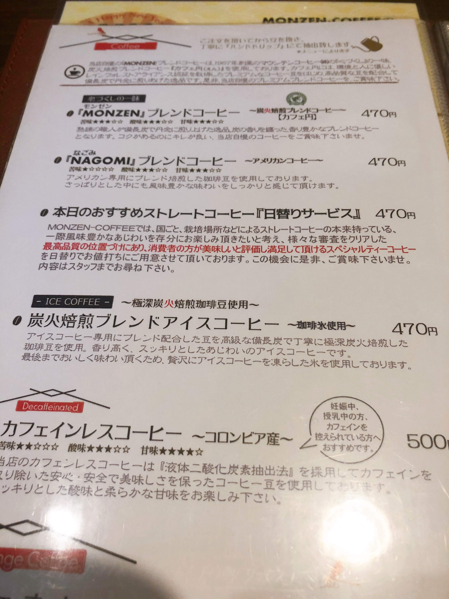<figcaption></figcaption></figure>

愛知県といえばモーニング文化。ドリンクを頼むとサービスでトースト、卵ペースト、サラダ、果物がついてきてなんと魅力的。モーニングの時間帯は7:00-11:00でした。

<figure><figcaption>モーニング</figcaption></figure>

最後に向かったのは、和菓子屋「桝分」さん。カフェを出て左に歩くとすぐです。

<figure>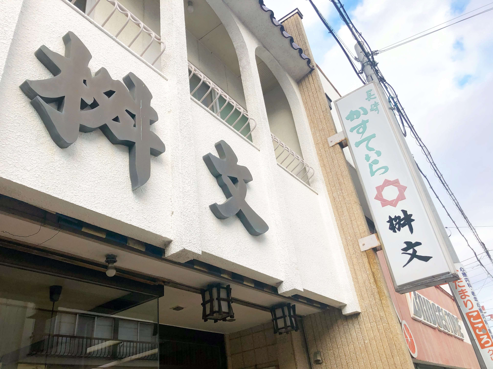<figcaption>桝分</figcaption></figure>

周りから評判を聞いていた「とろけるわらび餅」をお土産に購入。

<figure>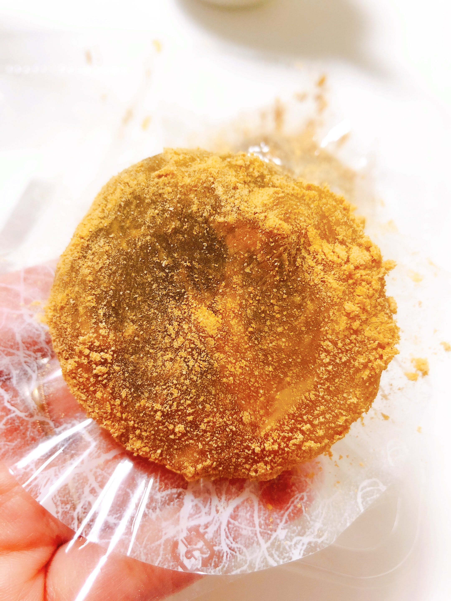<figcaption></figcaption></figure>

名前の通りやわらかくて口にいれると溶ろけそうな食感。中の甘いこしあんときなこはベストマッチ！きなこ自体は甘くないので和菓子の甘さが苦手な私でもペロリと完食！これはオススメです！！

甚目寺観音は毎月12日に「甚目寺観音てづくり朝一」（10:00-14:00)や2月3日に節分会(8:00-17:00)で賑わっているそうです。ぜひ一度足を運んだ際はお土産にいかがですか。

